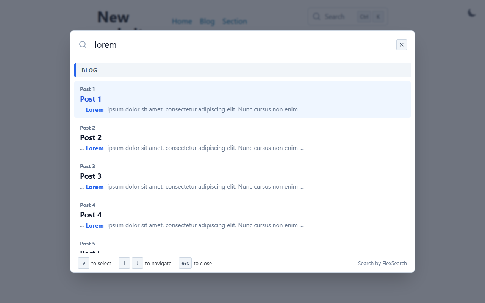

# FlexSearch component theme

The _FlexSearch_ component theme for [Cecil](https://cecil.app) adds a client side full-text search to a website, powered by [FlexSearch](https://github.com/nextapps-de/flexsearch): a search index generated at build time and a [DocSearch](https://docsearch.algolia.com)-like modal.



**[Demo](https://cecilapp.github.io/theme-flexsearch/)**

## Features

- **No service**: the index is a static JSON file, generated at build time (one per language)
- **DocSearch-like modal**: `Ctrl`/`⌘` + `K` shortcut, keyboard navigation, fullscreen on mobile (with an icon-only trigger)
- **Results grouped by section**, each section being ranked and limited on its own
- **Split pages**: one record per `<h2>`/`<h3>` heading, linked to its anchor
- **Highlighting** of the matched terms, and fuzzy matching when nothing matches strictly
- **Lazy loading**: the library and the index are loaded on first use
- **Customizable** styles (CSS custom properties) with light and dark modes
- **Translatable** (English and French included)

## Installation

```bash
composer require cecil/theme-flexsearch
```

> Or [download the latest archive](https://github.com/Cecilapp/theme-flexsearch/releases/latest/) and uncompress its contents in `themes/flexsearch`.

## Usage

Add `flexsearch` in the `theme` section of the `config.yml`:

```yaml
theme:
  - flexsearch
```

Add the stylesheet in the HTML `<head>` of the main template:

```twig
{{ html(asset('flexsearch/flexsearch.css')) }}
```

> [!TIP]
> The stylesheet can also be bundled with your own: `asset(['css/styles.css', 'flexsearch/flexsearch.css'])`.

Add the search box (trigger button and modal) where the button should be displayed, for example in the header:

```twig
{{ include('partials/flexsearch.html.twig') }}
```

The trigger button and the modal can also be included separately:

```twig
{# in the header #}
{{ include('partials/flexsearch/trigger.html.twig') }}
{# before </body> #}
{{ include('partials/flexsearch/dialog.html.twig') }}
```

Any element with a `data-flexsearch-open` attribute opens the modal:

```html
<a href="#" data-flexsearch-open>Search</a>
```

### Configuration

The indexed sections are listed under `flexsearch.sections`, in the order of the result groups. By default, every root section of the website is indexed.

```yaml
flexsearch:
  sections:
    docs:
      limit: 5 # maximum number of results in the group
    blog:
      title: Posts # title of the group
      limit: 3
      split: false # one record per post, not one per heading
      date: true # show the date of the post in the search results
```

Section options:

| Option   | Default                   | Description                                                            |
| -------- | ------------------------- | ---------------------------------------------------------------------- |
| `title`  | title of the section page | title of the group of results                                          |
| `limit`  | `5`                       | maximum number of results displayed in the group                       |
| `split`  | `true`                    | one record per `<h2>`/`<h3>` heading, or a single record per page      |
| `date`   | `false`                   | add the page date to its records (displayed instead of the breadcrumb) |
| `length` | `1000`                    | maximum length of the indexed text of an unsplit page                  |

Search options (default values):

```yaml
flexsearch:
  enabled: true # display the search box
  version: '0.8.212' # FlexSearch library version, loaded from jsDelivr
  library: '' # URL of the FlexSearch library (overrides `version`)
  hotkey: k # Ctrl/⌘ + hotkey opens the search box (false to disable)
  credit: true # display the "Search by FlexSearch" credit
  tokenize: forward # strict, forward, reverse or full
  encoder: Normalize # FlexSearch.Charset: Exact, Default, Normalize, LatinBalance, LatinAdvanced, LatinExtra, LatinSoundex…
  fields: # indexed fields and their resolution (weight, from 1 to 9; 0 to not index the field)
    title: 9
    page: 7
    description: 5
    content: 3
  suggest: true # fall back to fuzzy matching when nothing matches strictly
  min_length: 1 # minimum length of the query to start searching
  delay: 120 # delay (ms) after typing before searching
  boundary: 160 # maximum length of a highlighted snippet
  snippet: 180 # maximum length of a non highlighted snippet
```

> [!NOTE]
> The FlexSearch library is downloaded from jsDelivr at build time, and published with the website.

### Index

The index is published at `/flexsearch.json` (and `/<language>/flexsearch.json` for other languages). For each section:

- the root page of the section is skipped, pages of its sub-sections are included
- split pages are cut on their `<h2>` and `<h3>` headings, and their introduction is indexed under the page title
- anchors are read from the `id` attribute of the headings
- pages excluded from lists (`exclude: true`) are not indexed

### Styles

Colors and sizes are defined as CSS custom properties, with light and dark defaults. The dark mode follows the system preference, unless the root element has a `data-theme` attribute (as set by Cecil's theme selector) or a `dark`/`light` class.

Override them in your own stylesheet:

```css
:root {
  --flexsearch-accent: #163c56;
  --flexsearch-selected-bg: #f2d07f;
}
:root.dark {
  --flexsearch-accent: #f2d07f;
}
```

| Property                       | Usage                                       |
| ------------------------------ | ------------------------------------------- |
| `--flexsearch-color`           | text                                        |
| `--flexsearch-bg`              | modal background                            |
| `--flexsearch-heading-color`   | input and results titles                    |
| `--flexsearch-muted`           | status, breadcrumb, snippet, footer         |
| `--flexsearch-subtle`          | icons and placeholder                       |
| `--flexsearch-border`          | trigger button and modal borders            |
| `--flexsearch-divider`         | separators inside the modal                 |
| `--flexsearch-surface`         | keys and group titles background            |
| `--flexsearch-surface-color`   | keys and group titles text                  |
| `--flexsearch-surface-border`  | keys border                                 |
| `--flexsearch-accent`          | hover border, group title border            |
| `--flexsearch-mark-color`      | highlighted terms                           |
| `--flexsearch-selected-bg`     | selected result background                  |
| `--flexsearch-selected-color`  | selected result text                        |
| `--flexsearch-backdrop`        | modal backdrop                              |
| `--flexsearch-radius`          | modal border radius                         |
| `--flexsearch-width`           | modal maximum width                         |
| `--flexsearch-trigger-width`   | trigger button width                        |

All elements have a `flexsearch-*` class, so the styles can also be fully replaced.

### Internationalization

The theme is translated in English and French. Extract the strings to translate in another language with:

```bash
cecil util:translations:extract --locale=<locale> --save --theme=flexsearch
```

## License

_FlexSearch_ component theme is a free software distributed under the terms of the MIT license.

[FlexSearch](https://github.com/nextapps-de/flexsearch) © Thomas Wilkerling, released under the Apache 2.0 license.
